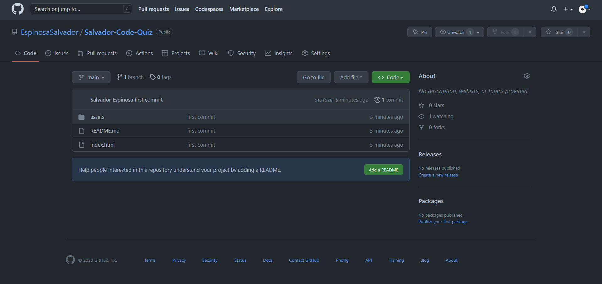

# Salvador-Code-Quiz

## Table of Content

* [Introduction](#introduction)
* [Features](#features)
* [Requirements](#requirements)
* [Installation](#installation)
* [Configuration](#configuration)
* [Troubleshooting](#troubleshooting)
* [FAQ (Frecuently Asked Questions)](#faq-frecuentrly-asked-questions)
* [Team](#team)

## Introduction

This is my first code quiz using JavaScript please let me know in what may I improve my code. I am eager to learn and to inspire people to work on other peoples code as I did.

## Features

This are the following feautures of the Code Quiz
<!-- ! To be worked on -->

## Requirements

the requirements to run this webpage are really low due that we are only using *HTML*, *CSS* and *JS*.

* Vs code
* GitHub
* Internet
* Download JS to its latest release.

## Installation

To install this project please proceed to my [GitHub Repository](https://github.com/EspinosaSalvador/Salvador-Code-Quiz)

you should be able to see this,



Click on code as shown in the image


Copy the SSH key or the HTTPS key and open.

* Terminal
* Git bash
* CMD

either one of this will work. please proceed to the terminal an put in your Terminal,

```
git clone git@github.com:EspinosaSalvador/Salvador-Code-Quiz.git
```

and now you have a copy of the code.

## Configuration

If you want to do any configurations on this project please open a new branch you can do this by putting the following code in your terminal,

```
git checkout -b ＜new-branch＞
```

switch branches putting the following code on your terminal.

```
git checkout ＜branchname＞
```

If you want to show us your code and merge please open a pull request on [Github](https://github.com/EspinosaSalvador/Salvador-Code-Quiz/pulls).

## Troubleshooting

The Code Quiz is in version 1.0 ,please let me know if there are anybug in the webpage by issuing it in [Github](https://github.com/EspinosaSalvador/Salvador-Code-Quiz/issues)

## FAQ (Frecuentrly Asked Questions)

We will update this part when we have some frequently asked question.

## Team

* Salvador Espinosa Valdez

at this moment 04/01/2023 I am the only one working on this project
